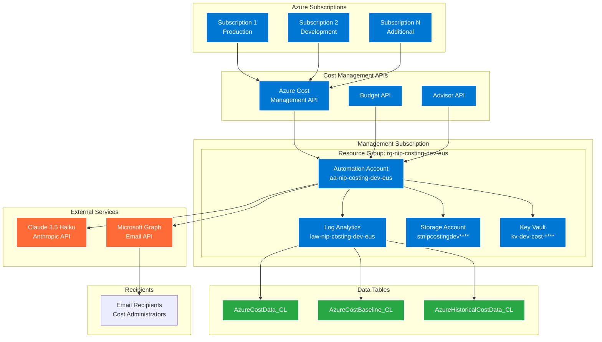
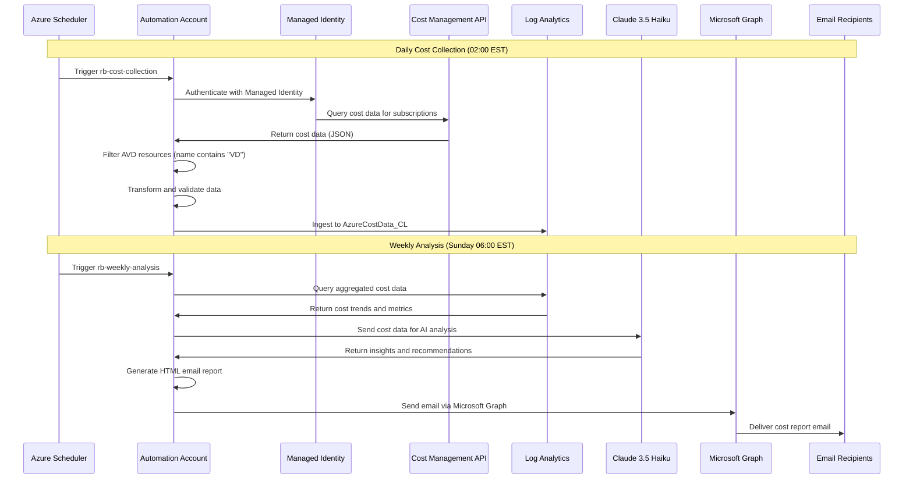
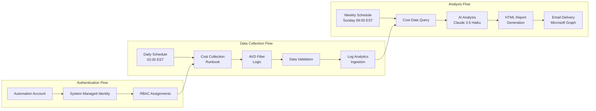
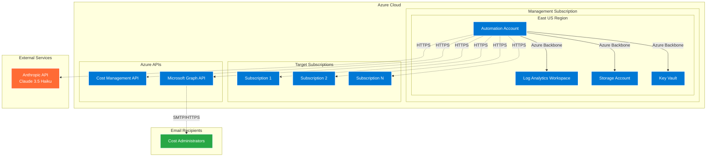
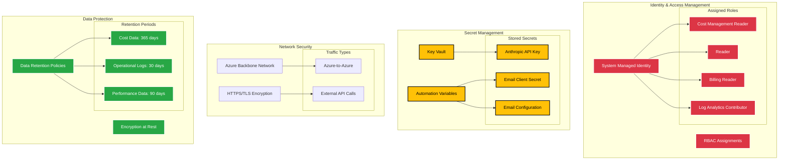
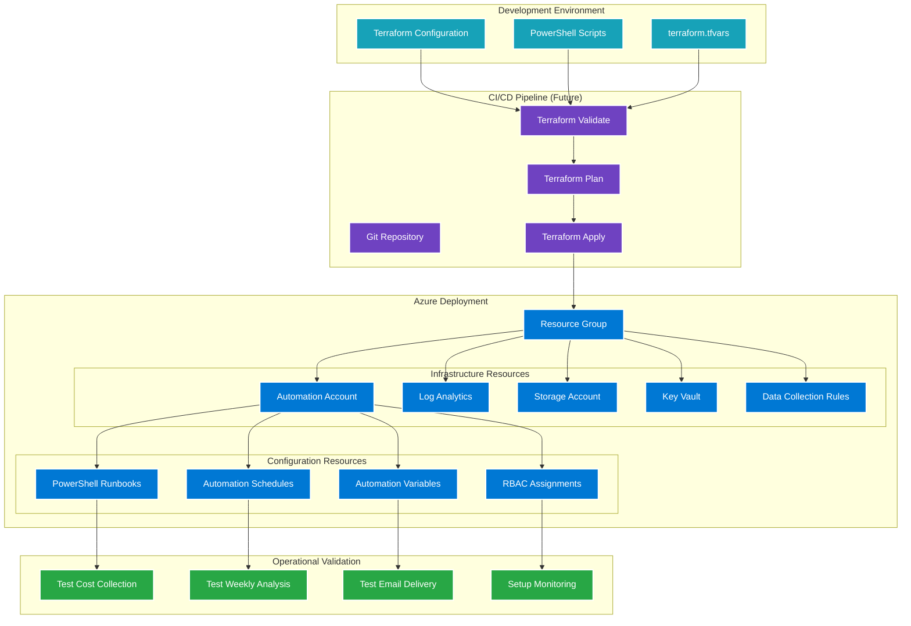

# Architecture Diagrams

## System Architecture Overview

## Data Flow Architecture

## Component Interaction Details

## Network Architecture

## Security Architecture

## Deployment Architecture

